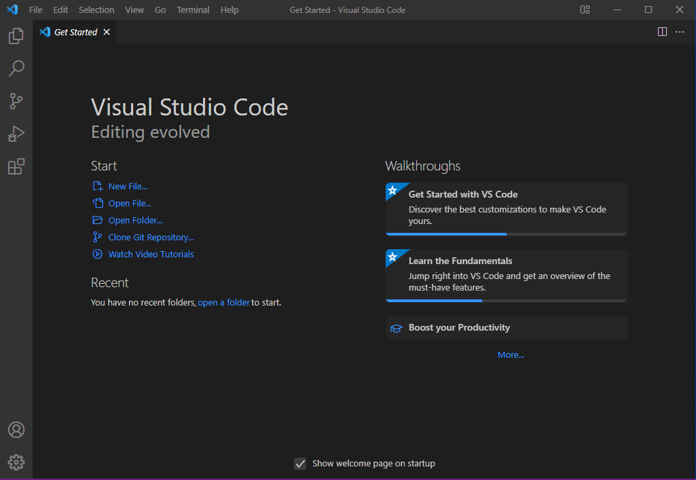

# SE-Assignment-5

Installation and Navigation of Visual Studio Code (VS Code)
Instructions:
Answer the following questions based on your understanding of the installation and navigation of Visual Studio Code (VS Code). Provide detailed explanations and examples where appropriate.

Questions:

1.  Installation of VS Code:

    - Describe the steps to download and install Visual Studio Code on Windows 11 operating system. Include any prerequisites that might be needed.

    ### Installation of VSCode on Windows 11 Step by Step:

    - Open a web browser in a Windows 11 PC and search "Visual Studio Code" or "VSCode" and from the search results select the official VSCode site [https://code.visualstudio.com/](https://code.visualstudio.com/)
    - Download VSCode and save it in your prefered location
    - After downloading is complete, navigate to where VSCode was downloaded and double click the installer (VSCodeSetup-x64.exe)
    - Windows will ask if you want to allow the setup to make changes, Click Yes to continue with installation
    - Installer will also ask you to accept the terms and conditions, read the agreement and click I accept to agree. Then click Next
    - If the installer asks you to choose installation location, let is use the default location then click Next
    - Additiona Tasks window will appear. Check the Create a desktop checkbox if you want to add VSCode icon on the desktop. It is also advisable to check the remaining options and click Next
    - Then it will ask to begin the installation setup. Click on the Installl button
    - After clicking the Installa button, it will take about 2 minutes to installl VSCode on your Windows 11 machine
    - After the Installation setup for VSCode is finished, it will show a window like this below. Tick the “Launch Visual Studio Code” checkbox and then click Finish.

    

    - After the previous step, the VSCode window opens successfully.

    

2.  First-time Setup:

    - After installing VS Code, what initial configurations and settings should be adjusted for an optimal coding environment? Mention any important settings or extensions.

    > After successfully installing VSCode, you can decide to configure VSCode to suit your preferences and enhance your experience when coding. To adjust configurations open VSCode and go to `File>Preferences>Settings` or use shortcut Ctrl+,(comma).
    > Some of the initial configurations include:
    >
    > 1. **Theme**: Theme enhances readability. Choose between Dark or Light
    > 2. **Font**: Select font which will be comfortable to read when you are coding for a long time
    > 3. **File Associations**: To ensure that when you double-click a file type, it automatically opens in VSCode, associate specific file types with VSCode if necessary.
    > 4. **Extensions**: VSCode extensions provide extra features. Some impoprtant extensions include:
    >    - Prettier- to format source code
    >    - Language extensions such Python, PHP, JavaScript, Java, Dart, Flutter etc
    >    - GitLesns- for assist in Git integration
    >    - Bracket Pair Coloriser- to apply colors in bracket pairs for visibility
    >    - Docker- to manage containerized applications
    > 5. Sign in VSCode to be able to sync settings and configurations across multiple devices
    > 6. Editor enhancements such as code folding, minimap and visibility of line numbers

3.  User Interface Overview:

    - Explain the main components of the VS Code user interface. Identify and describe the purpose of the Activity Bar, Side Bar, Editor Group, and Status Bar.

      > ### Main Components of VSCode UI
      >
      > 1.  **Editor Area**: located at the center of VSCode. This is where you write and edit your code
      > 2.  **Menu Bar**: located at the top of VSCode with menus like File, Edit,View etc. These menus provide access to a range of features within VSCode
      > 3.  **Activity Bar**: located on the side of VSCode with features such as Explorer Search, Source Control, Extensions etc
      > 4.  **Side Bar**: located adjacent Activity Bar and has features such as Explorer and Search. Explorer shows the files in your current project which you are working on and Search enables you to search within your project
      > 5.  **Status Bar**: located at the bottom of the window displaying quick actions and other information
      > 6.  **Panel Area**: This is hidden by default, you can toggle it to access panels like Output, Debug, Console and Terminal
      > 7.  **Extensions View**: can be accessed from the activity bar and allows to manage extensions such as searching, installing and managing
      > 8.  **Command Palette**: located at the top of VSCode and accessed by command `Ctrl + Shift + P`, it allows executing commands and tasks within VSCode by using their names

4.  Command Palette:

    - What is the Command Palette in VS Code, and how can it be accessed? Provide examples of common tasks that can be performed using the Command Palette.

      > The Command Palette is a hidden panel which hosts a number of commands and tasks within VSCode. To access it use the command `Ctrl + Shift + P` for Windows/Linux or `Cmd + Shift + P` for macOS. The picture below shows a command palette:
      >
      > 
      > Example of task you can perform using the paletter include
      >
      > - Creating a new file
      > - Opening a file
      > - Toggle line numbers on/off
      > - Toggle word wrap
      > - Save all open files
      > - Perform git commands such as add, commit ot push

5.  Extensions in VS Code:

    - Discuss the role of extensions in VS Code. How can users find, install, and manage extensions? Provide examples of essential extensions for web development.

    > VSCode extensions are add-ons that enhance the functionalities of VSCode. Extensions provide additiona features, tools and integrations. With these extensions you can customise the IDE the way you want.
    >
    > ### How to find and install VSCode Extensions:
    >
    > There are two ways to find extensions:
    >
    > - Open `File>Preferences>Extensions` or
    > - From the Activity Bar
    >   The extensions panel will open which will enable you to search for new extensions from the marketplace and also manage installed extensions such as enable, disable, uninstall and also read the reviews and how to use
    >
    > ### Essential Extensions for Web include:
    >
    > - Live Server
    > - ESLint
    > - GitLens
    > - HTML Snippets
    > - CSS Peek
    > - Prettier
    > - Debugger for Chrome
    > - HTML CSS Support
    > - Bracket Pair Colorizer
    > - npm Intellisense

6.  Integrated Terminal:

    - Describe how to open and use the integrated terminal in VS Code. What are the advantages of using the integrated terminal compared to an external terminal?
      > ### Advantages of using the Integrated Terminal:
      >
      > The terminal is directly integrated with VSCode, allowing you to switch between conding and running commands without leaving VSCode
      > The integrated terminal is already aware of your current project, you dont need to change directories to access it
      > It adds efficient because it reduces time to switching between VSCode and a terminal
      > Increases productivity and development experience becomes smooth
      >
      > ### How to Open the Integrated Terminal
      >
      > You can open it in two ways:
      >
      > - Using shortcut as `` Ctrl + `  ``
      > - Using the Menu Bar `View>Terminal`
      > - Using Command Palette `Ctrl + Shift + P` for Windows/Linux or `Cmd + Shift + P` for macOS and search for `Terminal:Toggle Terminal`

7.  File and Folder Management:

    - Explain how to create, open, and manage files and folders in VS Code. How can users navigate between different files and directories efficiently?
      > ### To Create Files and Folders:
      >
      > - Go to Explorer View in the Side Bar on the left and right click on the directory where you want to create the file. Then select `New file` and give file name with extension of your choice such as `about_us.html`
      > - To create a new file, follow procedure above but select `New Folder` and give name such as `images`
      >
      > ### To open Files and Folders:
      >
      > - There are multple ways to open files and folders as follows:
      >   - Use `File>Open` in Menu Bar
      >   - Click on the `Open Folder` button in the Explorer View and select a directory to open
      >   - You can also drag and drop files/folders into VSCode
      >
      > Once the folder is opened in VSCode, you can all the contents in the Explorer View and you can navigate between files and folders.
      >
      > ### To efficiently navigate between files and directories:
      >
      > - Use keyboard shortcuts such as
      >   - `Ctrl + Tab` to switch between open files
      >   - `Ctrl + P` to open files by their names
      >   - `Ctrl+ \` to split the editor
      > - Use the Explorer View in the Side Bar to navigate between files/folders by using the expand/collapse feature to see/hide the folder content

8.  Settings and Preferences:

    - Where can users find and customize settings in VS Code? Provide examples of how to change the theme, font size, and keybindings.
      > ### To Access Settings in VSCode:
      >
      > - Open VSCode
      > - Go to Menu bar and select `File>Preferences>Settings`
      > - Use shortcut `Ctrl + ,`
      >
      > ### To change Theme
      >
      > - Go to `File>Preferences>Theme` and choose from existing themes
      >
      > ### To change font size:
      >
      > - Use shortcut `Ctrl + ,` to open Settings
      > - In the Settings View search for `font size` and change value
      >
      > ### To change keybindings:
      >
      > - From the Settings View, search for `keybindings`
      > - From the search results you will see options for `Keyboard Shortcuts` and `Keymap`, use this to customer keybindings

9.  Debugging in VS Code:

    - Outline the steps to set up and start debugging a simple program in VS Code. What are some key debugging features available in VS Code?
      > The following are steps to set up and start debugging:
      >
      > - First install the required extension for debugging such as `Debugger for Firefox`
      > - Secondly, open your project in VSCode
      > - Set breakpoints in your code at lines where you want the debugger to pause execution
      > - From the `Activity Bar` find and click Run and Debug button or press F5 on the keyboard
      > - Run program in Debug Mode
      >
      > ### VSCode has the following features for debugging:
      >
      > - Debugging Configuration
      > - Inline Debugging
      > - Conditional Breakpoints
      > - Exception Breakpoints

10. Using Source Control:
    - How can users integrate Git with VS Code for version control? Describe the process of initializing a repository, making commits, and pushing changes to GitHub.
      > ### Integrating Git with VSCode:
      >
      > - Install Git
      > - Open project in VSCode
      > - Initialize git repository by using the integrated terminal and run the command `git init`
      > - Stage changes to project files
      >   - Open Source Control View in the Side Bar to view files and stage changes by clicking the `+` next to the files you want to stage or click `+` next to `Changes` to stage all changes
      >   - Alternatively you can use an integrated terminal and use the following commands
      >     - To stage only a specific file use `git add file_name` example `git add index.php`
      >     - To stage all files use `git add .` or `git add *`
      > - Commit changes
      >   - Enter a commit message in the text box at the top of the Source Control View
      >   - Click the tick icon or press `Ctrl + Enter` to commit
      >   - Alternatively, you can use an Integrated Terminals and run command using `commit -m "commit message"`
      > - Push changes tp GitHub
      >   - Make sure you have account in GitHub
      >   - Login to your GitHub account and create a repository
      >   - Add GitHub remote URL to VSCode using Command Palette(`Ctrl + Shift + P`) and search for `Git:Add Remote`
      >   - Enter the URL of your GitHub repo
      >   - Push changes to GutHub using Source Control View and select `Push`
      > - Verify if changes are pushed successfully in GitHub

Submission Guidelines:

- Your answers should be well-structured, concise, and to the point.
- Provide screenshots or step-by-step instructions where applicable.
- Cite any references or sources you use in your answers.
- Submit your completed assignment by 1st July
